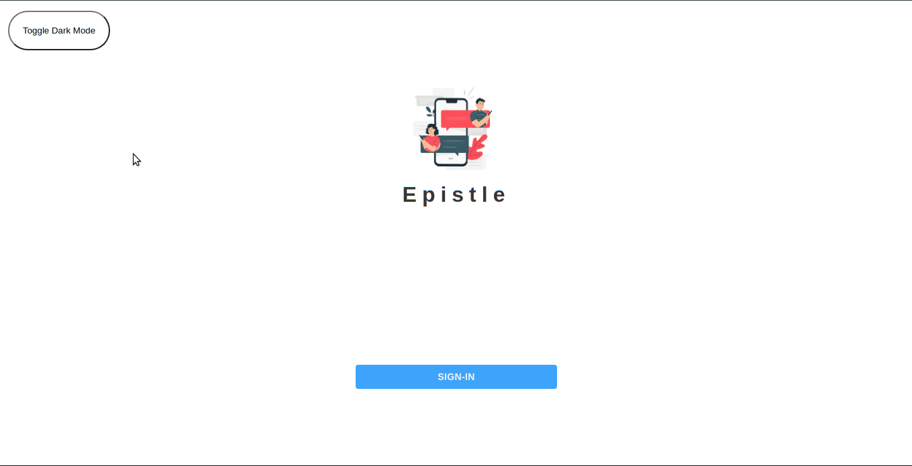

<h1 align="center">Epistle</h1>

<p align="center"></p>

<p align="center">This app lets you to have conversations with your friends and community members. You are just a click away !! First Sign-in with your Google account. Then create a room and enjoy the beautiful transitions of the messages. You can have chats in that room with the people of your domain or community. </p>

**Hope you like it ✌**

##### Deployed link - https://epistle-366a3.web.app/

### Setup
For running this application in your local system, follow the below given steps -
1. Clone this repository - ```gh repo clone pranjals149/Epsitle```
2. ```cd epistle```
3. ```npm install``` - to fetch the dependencies from **package.json** and install it in your system.
4. Now ```npm start``` to start the local server.

**You can view the application on ```localhost:3000```**

### Working of the application
This application is made by **ReactJs** and **firebase**. For Sign-In, it uses google authentication that is given by firebase. Profile pictures attached to your google account will be fetched automatically. After logging in to your account, press the icon next to search bar to create a new room. Have conversations in your room. Profile picture displayed on each room will be of the last user who sent the message. It also contains the timestamp which tells the time of the last sent message. The backend functionalities are provided by **firebase**.

### Working Screenshot



### Dependencies used
1. [Material-UI](material-ui.com)
2. [Redux Toolkil](https://redux.js.org/)
3. [firebase](https://firebase.google.com/)
4. [react-flip-move](https://github.com/joshwcomeau/react-flip-move)
